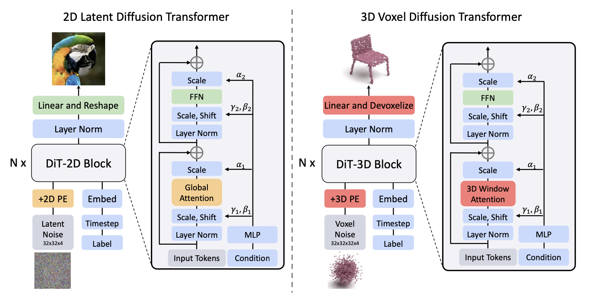

# DiT-3D: Exploring Plain Diffusion Transformers for 3D Shape Generation

### [**Project Page**](https://dit-3d.github.io/) | [**Paper**](https://arxiv.org/abs/2307.01831) | [**Hugging Face**](https://huggingface.co/papers/2307.01831) | [**Twitter**](https://twitter.com/_akhaliq/status/1676789843689455618)


🔥🔥🔥DiT-3D is a novel Diffusion Transformer for 3D shape generation, which can directly operate the denoising process on voxelized point clouds using plain Transformers.


<div align="center">
  
</div>


[**DiT-3D: Exploring Plain Diffusion Transformers for 3D Shape Generation**](https://arxiv.org/abs/2307.01831)
<br>Shentong Mo, Enze Xie, Ruihang Chu, Lanqing Hong, Matthias Nießner, Zhenguo Li<br>
arXiv 2023.


## Requirements

Make sure the following environments are installed.

```
python==3.6
pytorch==1.7.1
torchvision==0.8.2
cudatoolkit==11.0
matplotlib==2.2.5
tqdm==4.32.1
open3d==0.9.0
trimesh=3.7.12
scipy==1.5.1
```

Install PyTorchEMD by
```
cd metrics/PyTorchEMD
python setup.py install
cp build/**/emd_cuda.cpython-36m-x86_64-linux-gnu.so .
# PointNet++
pip install "git+https://github.com/erikwijmans/Pointnet2_PyTorch.git#egg=pointnet2_ops&subdirectory=pointnet2_ops_lib"
# GPU kNN
pip install --upgrade https://github.com/unlimblue/KNN_CUDA/releases/download/0.2/KNN_CUDA-0.2-py3-none-any.whl
```

Or please simply run

```
pip install -r requirements.txt
```


## Data

For generation, we use ShapeNet point cloud, which can be downloaded [here](https://github.com/stevenygd/PointFlow).


## Pretrained models
Pretrained models can be downloaded [here](https://drive.google.com/drive/folders/1sRnCObeDal3HeD-h_1L28gY9qE6fP0ZZ?usp=sharing).

Note that this pre-trained model is based on Small with a patch size of 4. We reported the XL models to the main table in our paper for final comparisons. 


## Training

Our DiT-3D supports multiple configuration settings:
- voxel sizes: 16, 32, 64
- patch dimensions: 2, 4, 8
- model complexity: Small (S), Base (B), Large (L) and Extra Large (XL)

For training the DiT-3D model (Small, patch dim 4) with a voxel size of 32 on chair, please run

```bash
$ python train.py --distribution_type 'multi' \
    --dataroot /path/to/ShapeNetCore.v2.PC15k/ \
    --category chair \
    --experiment_name /path/to/experiments \
    --model_type 'DiT-S/4' \
    --bs 16 \
    --voxel_size 32 \
    --lr 1e-4 \
    --use_tb
# for using window attention, please add flags below
    --window_size 4 --window_block_indexes '0,3,6,9'
```
Please check more training scripts in the [scripts](./scripts) folder.

During training, we train each model using each category for 10,000 epochs. We evaluated the test set using checkpoints saved every 25 epochs and reported the best results.

## Testing

For testing and visualization on chair using the DiT-3D model (S/4, no window attention) with voxel size of 32, please run

```bash
$ python test.py --dataroot ../../../data/ShapeNetCore.v2.PC15k/ \
    --category chair --num_classes 1 \
    --bs 64 \
    --model_type 'DiT-S/4' \
    --voxel_size 32 \
    --model MODEL_PATH

```
Testing this S/4 model, you should get performance close to the tables below.

|Model |    Train Class   |     Test Class     |  1-NNA-CD  | 1-NNA-EMD | COV-CD | COV-EMD|
|:------:|:--------------:|:---------------:|:-----:|:---:|:----:|:----:| 
|[DiT-3D-S/4](https://drive.google.com/file/d/19-4Ls9hNDGv0LPuQ-zKn2SUTOc_2-R33/view?usp=sharingg)|   Chair   | Chair | 56.31 | 55.82 | 47.21   | 50.75  |

   

For point clouds rendering, we use [mitsuba](https://github.com/mitsuba-renderer/mitsuba2) for visualization. 


## Citation

If you find this repository useful, please cite our paper:
```
@article{mo2023dit3d,
  title = {DiT-3D: Exploring Plain Diffusion Transformers for 3D Shape Generation},
  author = {Shentong Mo and Enze Xie and Ruihang Chu and Lewei Yao and Lanqing Hong and Matthias Nießner and Zhenguo Li},
  journal = {arXiv preprint arXiv: 2307.01831},
  year = {2023}
}
```

## Acknowledgement


This repo is inspired by [DiT](https://github.com/facebookresearch/DiT) and [PVD](https://github.com/alexzhou907/PVD). Thanks for their wonderful works.


